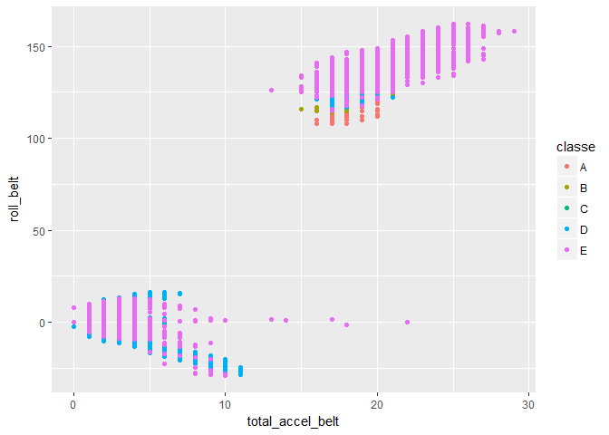

# Predicting Activty using Fitness Device Data
Ryan Morton  
April 21, 2017  


## Summary

This paper fits a random forest model to fitness device data to predict whether a lift was performed well. The model had a OOB esimate of 3.95% when classifying the training data.

## Data and Exploratory Data Analysis

The data comes from Groupware.  More information may be found at:  http://groupware.les.inf.puc-rio.br/har

We will use the caret, ggplot2, and randomForest packages in R to train and test the model.  The csv file was downloaded and read into R.  The csv file needed to be transformed so that all variables were numeric except for the variable  *classe*. Columns that had somes equal to 0 were removed. Seed was set for reproducibility.


```r
set.seed(123)

url <- "https://d396qusza40orc.cloudfront.net/predmachlearn/pml-training.csv"

###train data
df <- read.csv(url(url), stringsAsFactors = FALSE)
df.train <- df[,-(1:7)]
df.train[] <- lapply(df.train, function(x){
  if(is.factor(x) | is.character(x) | is.integer(x)) as.numeric(as.character(x)) else x
})
df.train <- df.train[, abs(colSums(df.train, na.rm = TRUE)) > 0]
df.train$classe <- factor(df$classe)
train.names <- names(df.train)
```

To get a sense of the data, a scatterplot was created to compare total acceleration and roll by each *classe*.  There's clearly a division betwen classes where A,B, and C are closesly related while D and E follow two major patterns.


```r
ggplot(df.train, aes(x = total_accel_belt, y = roll_belt, color = classe, group = classe)) +
  geom_point()
```

<!-- -->

## Model Selection and Training

Given the large amount of variables that could be considered in classification, the data was preprocessed using principal components analysis and NA's imputed using kNN. The goal was to use the least amount data to predict the best results.

Random Forest was selected as the classification model so many classification trees could be evaluated and promote the most important variables for classification. Cross validation methods were used to train the model and the confusion matrix reported below.  The Out of Bag estimate of error rate came out as 3.95% with the D class having the highest error rate of about 6%.


```r
##Preprocessing

df.preprocess <- preProcess(df.train, method = c("pca", "knnImpute"))

trainTransformed <- predict(df.preprocess, df.train)

#model fitting
randomForesFit <- train(classe ~ .,
               data = trainTransformed,
               method = "rf",
               na.action = na.pass,
               #preProcess = c("pca"),
               trControl = trainControl(method = "cv", number = 5, savePredictions = TRUE))
print(randomForesFit$finalModel)
```

```
## 
## Call:
##  randomForest(x = x, y = y, mtry = param$mtry) 
##                Type of random forest: classification
##                      Number of trees: 500
## No. of variables tried at each split: 2
## 
##         OOB estimate of  error rate: 3.95%
## Confusion matrix:
##      A    B    C    D    E class.error
## A 5453   43   47   25   12  0.02275986
## B   94 3585   91    7   20  0.05583355
## C   52   57 3267   34   12  0.04529515
## D   26   16  126 3021   27  0.06063433
## E    4   19   37   26 3521  0.02384253
```

## Model Testing

The trained model then tested 20 test cases. The cases were classified as seen in the table below.


```r
###test data
url2 <- "https://d396qusza40orc.cloudfront.net/predmachlearn/pml-testing.csv"
df2 <- read.csv(url(url2), stringsAsFactors = FALSE)
df.test <- df2[,-(1:7)]
df.test[] <- lapply(df.test, function(x){
  if(is.factor(x) | is.character(x) | is.integer(x)) as.numeric(as.character(x)) else x
})

#df.test[is.na(df.test)] <-0

df.test <- df.test[, train.names[1:143]]

testTransformed <- predict(df.preprocess, df.test)
rpartTest <- predict(randomForesFit, testTransformed)

predDF <- cbind(df.test, rpartTest)
table(predDF$rpartTest)
```

```
## 
## A B C D E 
## 7 8 1 1 3
```
